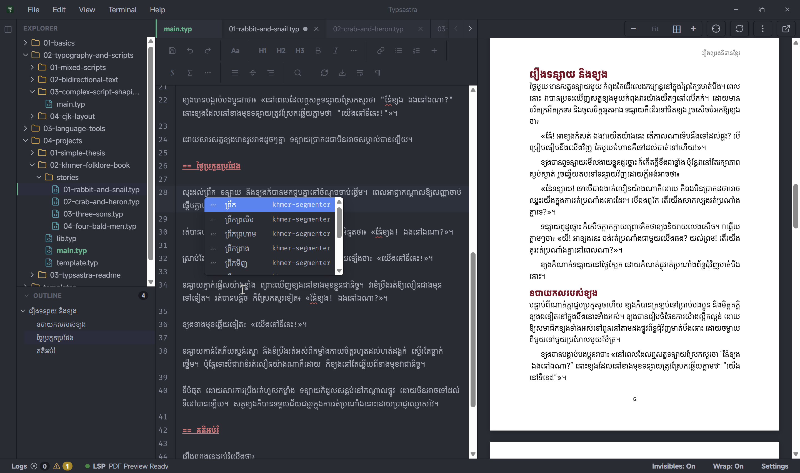
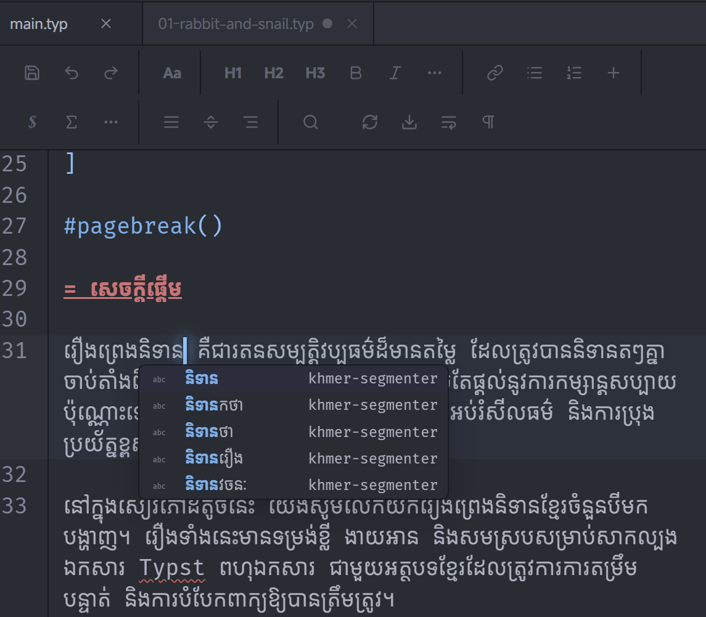
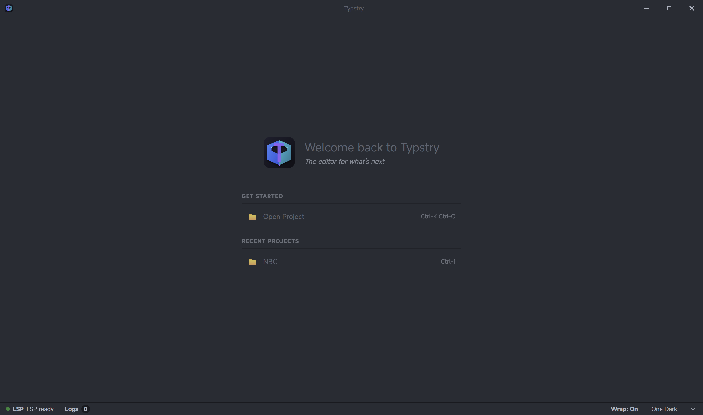

# Typsastra

> A complex-script-first Typst environment for research and long-form multilingual writing.

## Download Typsastra

Typsastra has pre-built desktop releases.

[Download the latest release](https://github.com/Sovichea/typsastra/releases/latest)

Available packages:

- Windows: `.msi`
- Linux: `.AppImage` and `.deb`
- macOS: experimental, unsigned and unnotarized build

Typsastra is currently beta software. The latest release is v0.7.0.

Typsastra is an open-source project and does not plan to purchase Apple
Developer ID signing or notarization. On macOS, Gatekeeper may therefore report
the experimental build as damaged. Download it only from the official release
page, then follow the narrowly scoped workaround in the
[installation guide](./docs/INSTALL.md#open-an-unsigned-macos-release).
Do not disable Gatekeeper globally.

[](https://github.com/Sovichea/typsastra/releases)
[](./LICENSE)
[](https://tauri.app/)

<p align="center">
  
</p>

## What is Typsastra?

Typsastra is a local-first writing environment for Typst, designed for research papers, technical documentation, theses, books, and other long-form documents.

Typsastra (pronounced “tip-SAS-tra”) began with a relatively focused goal: make writing complex scripts easier and more natural in a Typst editor.

The name combines Typst, the typesetting system at the center of the project, with *sastra*—a word associated with writing, literature, and knowledge. It reflects the idea that a document editor should support not only typesetting, but also the languages, scripts, and long-form work that give writing its meaning.

It serves writers and researchers whose languages are not always well supported by traditional technical-writing tools. Typsastra focuses on Unicode-safe editing, script-aware interaction, responsive PDF preview, extensible language tools, and multi-file project workflows while keeping the underlying Typst source portable.

Khmer is the first language with deep support, including tailored cursor and deletion behavior, spellcheck, and word completion. Khmer demonstrates the depth Typsastra aims to provide; it is not the boundary of the project. The editing-policy and language-provider architecture is designed so other languages can add their own behavior without changing or weakening Khmer support.

## v0.7.0 feature showcase

Typsastra v0.7.0 adds resource-aware image workflows, secure Markdown live
preview, and persistent PDF color modes while retaining the Draft Preview,
document typography, private-font, and source-navigation features introduced
throughout v0.6.x.

Choose **Open Examples** from the welcome screen and follow
`07-v0.7-feature-showcase` for Markdown preview guidance, then use
`06-v0.6-feature-showcase/01-draft-preview-and-image-guidance` to exercise the
new Image Tools workspace with bundled raster assets.

### Markdown live preview

Opening a `.md` or `.markdown` file activates a separate sanitized preview for
common GitHub-Flavored Markdown. Local images and workspace links are resolved
inside the open project, remote resources are not loaded automatically, and
the existing Typst PDF session remains available when returning to source.

<!-- Replace this placeholder with the Markdown-preview screenshot or video URL. -->
<p align="center">
  
</p>

### Dark and inverted PDF preview

Compiled documents and standalone PDFs can use their authored colors, a
hue-preserving Dark Preview, or an experimental full inversion. Dark Preview
keeps detected embedded images in their original colors while adapting the rest
of the page for a dark workspace. The selected mode is remembered, and exported
PDFs are never altered.

<!-- Replace this placeholder with the dark-preview screenshot or video URL. -->
<p align="center">
  
</p>

### Image Tools

Image Tools inventories project raster images, reports source and decoded
sizes, finds static Typst references, and prepares bounded resize or re-encoding
previews. Optimizations are saved as new copies; source images are not silently
overwritten. Authors may explicitly update the indexed static references to
the saved copy.

<!-- Replace this placeholder with the Image Tools screenshot or video URL. -->
<p align="center">
  
</p>

### Experimental Low-Memory Mode

Low-Memory Mode is an opt-in workflow for very long documents and
memory-constrained computers. Typsastra generates the PDF and an approximate
line-level navigation index with a one-shot Tinymist process, then terminates
Tinymist. The cached index supports manual source-to-preview navigation and
PDF-click inverse sync without keeping the compiler resident. Live LSP
diagnostics, Tinymist completion, formatting, and exact continuous sync remain
available in normal mode instead.


https://github.com/user-attachments/assets/563b6809-4003-4901-b5ee-4c56ed959d11


Read the [Low-Memory Mode guide](./docs/tutorials/LOW_MEMORY_MODE.md) for setup,
cache behavior, synchronization details, and current limitations.

### Draft Preview

Draft Preview replaces supported image calls in Typsastra’s private render mirror with lightweight, layout-preserving placeholders. Hover over a placeholder to inspect a cached thumbnail without adding the full image to the draft document. Normal Preview and exported PDFs continue to use the original images.


https://github.com/user-attachments/assets/b1c45806-8747-4180-8e52-dbe8222f82db


### Document typography and language tools

Assign fonts and language providers by writing script from one document-focused interface. Spellcheck and word completion are enabled through Document Typography, allowing different files in the same project to use different language tools while keeping the resulting Typst source explicit.


https://github.com/user-attachments/assets/f58e3133-e900-4a4b-9c63-7dee587b7e90

Fine per-script scaling can optically balance fonts whose glyphs appear at
different sizes even when Typst gives them the same point size:

<p align="center">
  
</p>


### Source and document navigation

Press `Alt+Enter` to trigger forward sync manually and reveal the current source location in the preview without animating through a long document. Outline navigation uses the same document relationship while keeping keyboard focus predictable.


https://github.com/user-attachments/assets/c3e44128-9e7b-49ff-aec2-3965de3572e1


Inverse sync and clickable references make it possible to move from rendered content back to its source, or follow internal and external document links directly in the preview. Hold `Ctrl` on Windows and Linux, or `Command` on macOS, while the pointer is inside the preview to reveal clickable references.


https://github.com/user-attachments/assets/56add64e-5d10-47fc-8b0a-30ce1388c46f


<details>
<summary>More v0.6.0 demonstrations</summary>

### Image optimization guidance

Typsastra profiles referenced raster images and reports unusually expensive assets without modifying them. Editor-gutter and preview-toolbar warnings help authors find images that may slow compilation or enlarge exported PDFs.

In this context, a high-resolution or pathological image is one whose decoded
pixel workload is disproportionately large for the size at which it appears in
the document. A compressed image may occupy only a few megabytes on disk while
expanding to hundreds of megabytes in memory, especially when a very large
photograph is scaled down to a small figure. These images can slow Typst
compilation, increase Tinymist memory usage in image-heavy documents, and slow
PDF loading, page rendering, and repeated live-preview updates.

Typsastra focuses on optimized document creation. Its current recommendations
identify expensive images and explain whether downscaling or re-encoding may
help, without changing the source asset automatically. Future releases will
add more non-destructive guidance and explicit optimization tools so authors
can improve preview and exported-PDF performance while retaining control over
image quality and project files.


https://github.com/user-attachments/assets/b9de3d81-47e7-4b34-b3d8-2fdb4e702e19


### Docked and undocked preview

The same virtualized PDF preview can be docked beside the editor or moved into a separate window while retaining its theme, controls, document position, Draft Preview interaction, and source-navigation behavior.


https://github.com/user-attachments/assets/c1278ad8-eca5-43c7-8aed-ba371ee8a14e


</details>

## Screenshots

### Editor and document preview

<p align="center">
  
</p>

### Khmer script-aware editing and language tools

<p align="center">
  
</p>

### Project workspace

<p align="center">
  
</p>

## Why Typsastra?

Most editors treat complex-script support as a font or rendering concern. Reliable authoring also depends on cursor boundaries, deletion behavior, IME input, Unicode-safe ranges, language segmentation, completion, search, diagnostics, and consistent source-to-preview navigation.

Typsastra treats these as core editor responsibilities. Script-aware editing policies remain separate from dictionaries and language tools, allowing each language to tailor only the behavior it owns. Khmer is the reference implementation for this architecture.

Typsastra also treats a document as a project rather than an isolated file. A real research document may contain a main file, templates, chapters, includes, bibliography databases, figures, data, and files that can be previewed independently. Typsastra is being designed around that structure while preserving compatibility with the standard Typst ecosystem.

## Highlights

- Local-first desktop authoring with ordinary, portable Typst source files.
- CodeMirror editing with Unicode-safe ranges and complex-script font fallback.
- Script-aware editing-policy registry with deeply tailored Khmer behavior.
- Khmer spellcheck and word completion through the pinned Khmer segmenter.
- Lao language support with ICU4X word segmentation and optional `lo_LA` Hunspell dictionary.
- English spellcheck bundled by default, with optional Hunspell-compatible dictionaries for additional languages.
- Independent controls for script-aware editing, spellcheck, and typing suggestions.
- Document-script language routing: each configured script can select one spellcheck and word-completion provider, with no keyboard or same-script guessing.
- Tinymist diagnostics with validated system or managed toolchain selection.
- Hardware-accelerated, virtualized PDF preview designed for responsive long-document scrolling and constrained memory use.
- Persistent document-color, dark, and experimental inverted preview modes for
  compiled and standalone PDFs.
- Direct in-app PDF viewing with editable current-page navigation.
- Sanitized Markdown live preview with workspace-bound local resources.
- Project Image Tools for raster inspection, optimization previews, optimized
  copies, and explicit static-reference updates.
- Main-document preview workflows for multi-file projects.
- Explicit source-to-preview navigation through the preview toolbar or keyboard shortcut.
- Portable `.typsastra` workspace state, lazy restored tabs, and confirmation before loading large files.
- Searchable recent-project history, signed update detection, and explicit Tinymist lifecycle management.
- Project support for templates, chapters, includes, bibliography files, figures, and external assets.
- Contributor framework for adding new complex-script languages without modifying core editor code.

## Language support

Language support is capability-based rather than all-or-nothing:

- **Deep support** includes a script editing policy, reliable segmentation, spellcheck, and word completion. Khmer is the first and reference deep implementation.
- **Enhanced support** adds a tokenizer or language-specific boundary logic without requiring custom editor behavior. Lao uses ICU4X word segmentation at this level.
- **Basic support** uses a compatible Hunspell dictionary where available. This can provide useful spellcheck, but it is not presented as reliable segmentation for languages that require a dedicated tokenizer.

Each language entry in Settings shows its support level, stability status, and which capabilities are actually available. The long-term goal is for contributors to add a language through explicit policy and provider modules without modifying generic CodeMirror integration or another language's implementation.

## Research-document workflow

Typsastra is designed around one project identity and one configured main document. Opening an included chapter keeps the full-document preview, scroll context, and source relationships intact instead of treating every active file as a separate document.

The scalable workflow covers:

- project and main-document identity;
- included chapters, templates, imports, bibliographies, figures, and data;
- debounced render-on-type for responsive short-document iteration and
  per-workspace render-on-save for long or resource-intensive documents;
- revision-safe diagnostics, language analysis, compilation, and source navigation;
- virtualized preview rendering for long PDFs;
- workspace restoration and recovery after compiler or LSP failures.

The detailed architecture and trackable work are recorded in the [complex-script-first implementation plan](./docs/COMPLEX_SCRIPT_FIRST_IMPLEMENTATION_PLAN.md).

## Preview synchronization

Typsastra keeps one live preview pinned to the configured main document, including
while editing files imported or included by that document.

Forward sync is currently a manual action so ordinary cursor movement and tab
switching never move the preview unexpectedly. To reveal the editor cursor in
the preview, use the **Reveal Cursor in Preview** button in the preview toolbar,
or press:

- Windows and Linux: `Alt+Enter`
- macOS: `Option+Enter`

Tinymist currently resolves this action to the correct PDF page and source line,
with the preview ripple appearing at the beginning of that line. Exact horizontal
cursor positioning within the line is not currently supported. Typsastra does
not attempt to infer it by matching extracted PDF text because that can produce
incorrect results for repeated text, generated content, mixed scripts, and
complex scripts such as Khmer.

See [PDF preview and source synchronization](./docs/PREVIEW_INTERCEPTION.md) for
the implementation details and current limitations.

## Quick start

1. Download the latest installer from [Releases](https://github.com/Sovichea/typsastra/releases/latest).
2. Install and open Typsastra.
3. Open a Typst workspace or use an included example from the welcome screen.
4. Configure fonts, language tools, preview behavior, and a validated system or
   managed Tinymist toolchain in Settings.

Typsastra can use a compatible validated Tinymist from the system `PATH` or
download a managed stable release for preview and diagnostics. A separate Typst
installation is not required for normal use.

## Documentation

- [Documentation and tutorial index](./docs/README.md)
- [Getting started](./docs/tutorials/GETTING_STARTED.md)
- [Projects and main files](./docs/tutorials/PROJECTS_AND_MAIN_FILES.md)
- [Multilingual spellcheck](./docs/tutorials/MULTILINGUAL_SPELLCHECK.md)
- [Document typography](./docs/tutorials/DOCUMENT_TYPOGRAPHY.md)
- [Long-document workflow](./docs/tutorials/LONG_DOCUMENT_WORKFLOW.md)
- [Low-Memory Mode](./docs/tutorials/LOW_MEMORY_MODE.md)
- [PDF preview and source synchronization](./docs/tutorials/PDF_PREVIEW_AND_SYNC.md)
- [Markdown live preview](./docs/tutorials/MARKDOWN_PREVIEW.md)
- [Image Tools](./docs/tutorials/IMAGE_TOOLS.md)
- [Roadmap](./docs/ROADMAP.md)
- [Troubleshooting](./docs/TROUBLESHOOTING.md)
- [Typsastra v0.7.0 release notes](./docs/RELEASE_NOTES_V0.7.0.md)
- [Typsastra v0.6.3 release notes](./docs/RELEASE_NOTES_V0.6.3.md)
- [Typsastra v0.6.2 release notes](./docs/RELEASE_NOTES_V0.6.2.md)

## Contributing a language

Typsastra has a documented contributor framework for adding new complex-script languages. A contributor can implement a new language by following the guide without editing any generic CodeMirror integration or Khmer code.

The process at a glance:

1. Choose a support tier (Basic, Enhanced, or Deep) based on available data and segmentation.
2. Implement a Rust `LanguageSegmenter` using the annotated provider template.
3. Optionally implement a TypeScript `ScriptEditingPolicy` for script-specific cursor and deletion behavior.
4. Create reference fixtures for editing, language analysis, mixed-script, and non-BMP text.
5. Run `bun run conform` and `cargo test --lib segmentation` — no Tauri build required.
6. Follow the promotion checklist to reach stable status.

Resources:
- [Language contributor guide](./docs/LANGUAGE_CONTRIBUTOR_GUIDE.md)
- [Compatibility and promotion policy](./docs/COMPATIBILITY_POLICY.md)
- [TypeScript policy template](./src/editor/editingPolicies/template/policy.ts)
- [Rust provider template](./docs/templates/provider_template.rs)
- [Fixture templates](./tests/fixtures/template/)

CI automatically enforces: no duplicate script ownership, no missing licenses, no Khmer regressions, and passing conformance tests on Windows and Linux.

## Beta status

Typsastra is beta software. Windows and Linux builds are the most actively tested. macOS builds are experimental and intentionally distributed without Apple Developer ID signing or notarization. See the [macOS installation instructions](./docs/INSTALL.md#open-an-unsigned-macos-release) if Gatekeeper reports that the downloaded app is damaged.

When reporting an issue, include:

- operating system and installer;
- Typst project structure and main-file configuration;
- language and script;
- a minimal source example where possible;
- preview, diagnostics, font, cursor, wrapping, search, or language-tool symptoms.

## For developers

```bash
git clone --recurse-submodules https://github.com/Sovichea/typsastra.git
cd typsastra
bun install --frozen-lockfile
bun run tauri:dev
```

### Validation commands

```bash
bun test                  # all frontend tests
bun run conform           # policy and provider conformance (no Tauri needed)
bun run build             # TypeScript compilation check
cargo fmt --check         # from src-tauri/
cargo check --lib         # from src-tauri/
cargo test --lib          # from src-tauri/
```

See the [development guide](./docs/DEVELOPMENT.md) for full contributor requirements and the [skills reference](./docs/SKILLS.md) for the complete architecture guide.

## License

Typsastra is released under the [MIT License](./LICENSE).
