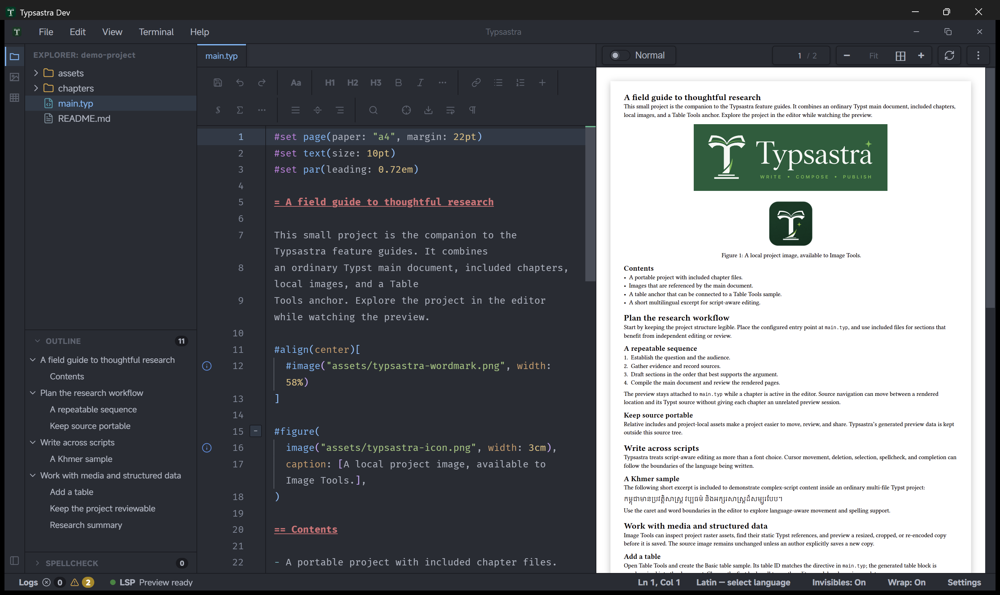

# Typsastra Documentation

Typsastra is a local-first writing environment for Typst, designed for research,
technical documentation, theses, books, and multilingual long-form writing.

This site brings together step-by-step workflows, tool references, language
guides, and contributor documentation.

## Start here

- [Getting started](tutorials/GETTING_STARTED.md) — open or create your first project.
- [Projects and main files](tutorials/PROJECTS_AND_MAIN_FILES.md) — understand multi-file projects and main documents.
- [Create from templates](tutorials/PROJECT_TEMPLATES.md) — browse Universe, offline, and user templates.
- [PDF preview and synchronization](tutorials/PDF_PREVIEW_AND_SYNC.md) — work with live preview and source navigation.
- [Image Tools](tutorials/IMAGE_TOOLS.md) — inspect, crop, and optimize project images.
- [Table Tools](tutorials/TABLE_TOOLS.md) — create, link, and edit Typst tables.
- [Settings reference](SETTINGS.md) — configure editing, preview, language tools, and appearance.

## Explore the documentation

Use the navigation to browse tutorials and user references. The [feature
guide](FEATURES.md) groups the product documentation, while the [development
guide](DEVELOPMENT.md) covers building and validating Typsastra itself.
