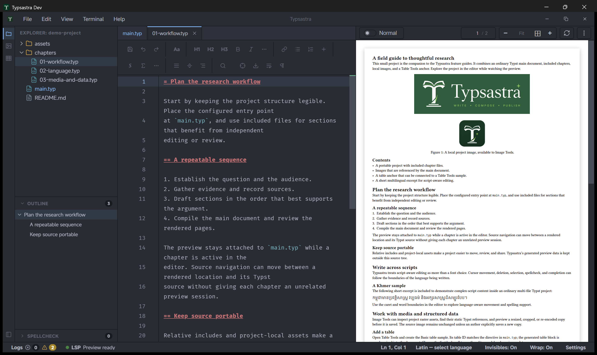

# Explorer and projects

Typsastra treats a project folder as the workspace. Source files stay ordinary
files on disk; project-specific settings live in `.typsastra/config.json`, and
the editing session is stored separately from source content.

## Open a project

Choose **Open Project** and select the folder containing the Typst sources.
Recent Projects provides quick access to recently opened workspaces. The
Examples action opens a writable example project that can be explored safely.
Use **Show All Recent Projects** to search the project history; the five most
recent projects also have direct `Ctrl+1`…`Ctrl+5` / `Cmd+1`…`Cmd+5` shortcuts.

The Explorer lists project files and folders. Open a file to create or activate
an editor tab. Context actions include creating and renaming files, revealing a
file in the system explorer, copying paths, and setting a `.typ` file as the
project's main document.

Drag files into an Explorer folder to copy them into the project. Drag image
files into a Typst editor or paste an image from the clipboard to save a
collision-safe project asset and insert a source reference. Renaming an indexed
image updates its exact static references in Typst sources.

## Main files and included chapters

The configured main `.typ` file owns the project preview. Use **Set as Main
File** from a Typst file's context menu. Files included from the main document
share its compiler and preview; opening a chapter changes the editor tab without
switching the PDF to a separate chapter preview.

## Other project files

Images, data files, bibliographies, and other assets remain in their project
locations and can be referenced with relative Typst paths. The Image Tools and
Table Tools sidebars inventory project content without creating shadow source
files for internal UI state.

## Portable and machine-local data

The project `config.json` stores portable project choices such as the main file
and tables. `workspace.json` stores session state such as open tabs, layout, and
scroll positions. Render caches, generated PDFs, and source maps are kept in
machine-local application data. See [Project import and export](PROJECT_IMPORT_AND_EXPORT.md)
for sharing a project archive.

## Demonstration

The [`demo-project`](../demo-project/README.md) includes `main.typ`, three
chapter files, and local image assets. Use it to explore file navigation and
main-document ownership.
