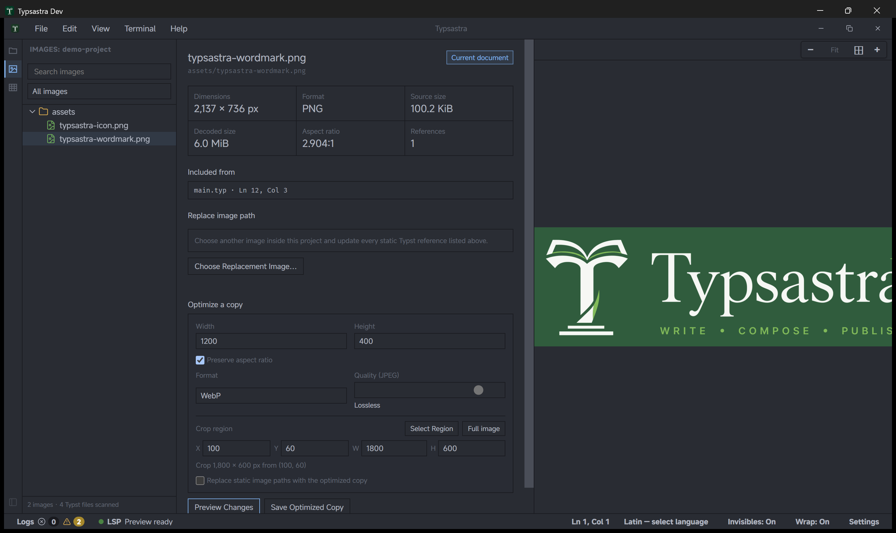

# Image Tools

Image Tools provides an explicit workspace for inspecting and optimizing local
raster assets without silently modifying the source project.

Open a workspace, select **Image Tools** from the sidebar, and choose an image.
The sidebar can filter all images, images used by the current document,
referenced or unused images, and images whose encoded or decoded size exceeds
the recommendation thresholds.

## Inspect and optimize

The inspector reports dimensions, format, encoded size, estimated decoded size,
and statically discovered `#image` references. PNG, JPEG, and WebP assets can be
resized or re-encoded; animated GIFs remain inspection-only.

1. Choose target dimensions and keep the aspect-ratio lock enabled unless a
   deliberate stretch is required.
2. Choose PNG, JPEG, or WebP. JPEG exposes a quality control; PNG and WebP use
   the currently supported lossless encoding path.
3. Select **Preview Changes** to generate a bounded comparison in Typsastra's
   machine-local application-data cache and review encoded and decoded size
   estimates.
4. Select **Save Optimized Copy** and choose a destination.
5. Optionally enable replacement of indexed static Typst paths with the saved
   copy.

The original image is not overwritten automatically. Reference updates apply
to all indexed exact static references for that asset; v0.7.0 does not offer a
single-reference-only rewrite. Dynamic paths, package resources, remote assets,
plugins, and unresolved expressions are not rewritten.

Renaming an image through the project explorer updates its indexed static Typst
paths. The replacement-image action can likewise point those static references
at another existing project image. Review source control or backups before
large reference changes.

Image inspection uses bounded cached previews in both the editor image viewer
and Image Tools. Once prepared, the same bounded result can be reused instead
of decoding a pathological source image again. Reopening a project restores the
active image only after its preview source is ready, so an old image is not
mistaken for the selected asset while loading.

Use the documentation [`demo-project`](../demo-project/README.md) or the bundled
`06-v0.6-feature-showcase/01-draft-preview-and-image-guidance` project to
exercise Image Tools with local raster files. Draft Preview remains
a separate source-preserving preview mode and never exports placeholders.
