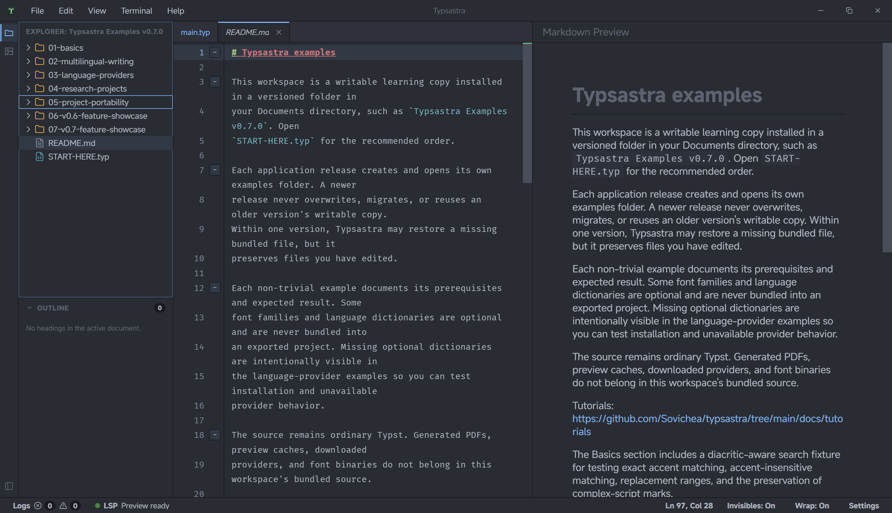

# Markdown live preview

Open a `.md` or `.markdown` file inside a Typsastra workspace to activate the
Markdown editor and live preview. Markdown uses its own renderer: it does not
start Tinymist, compile Typst, change the configured main file, or discard the
last successful PDF preview.

## Supported content

The v0.7.0 renderer supports common GitHub-Flavored Markdown:

- headings, paragraphs, emphasis, strong text, and block quotes;
- ordered, unordered, and task lists;
- tables and horizontal rules;
- fenced and inline code;
- links and statically referenced local images;
- Unicode and mixed-script text using the browser's standard bidirectional
  behavior.

Rendering follows the selected Typsastra theme. Each Markdown tab retains its
own scroll position across edits and tab switches.

## Links and images

Hold `Ctrl` on Windows or Linux, or `Command` on macOS, while activating a
Markdown link. Workspace-relative links open through Typsastra's normal file
policy. External URLs open only after this explicit gesture.

Local image paths resolve relative to the Markdown document and must remain
inside the open workspace. Remote images, missing files, unsupported sources,
and paths outside the workspace appear as unavailable resources; Typsastra does
not fetch them automatically.

## Security and limitations

Project Markdown is treated as untrusted content. Typsastra sanitizes generated
HTML and removes scripts, event handlers, forms, iframes, embedded objects,
style injection, and unsafe resource attributes.

v0.7.0 does not provide Markdown-to-Typst conversion, rich-text editing,
Markdown PDF export, executable code blocks, diagrams, plugins, or source-to-
preview synchronization. Typst-specific preview actions remain unavailable
until a Typst or PDF document becomes active again.

Try the bundled `07-v0.7-feature-showcase/01-markdown-live-preview` example for
a table, task list, mixed scripts, code, workspace links, and a local image.
