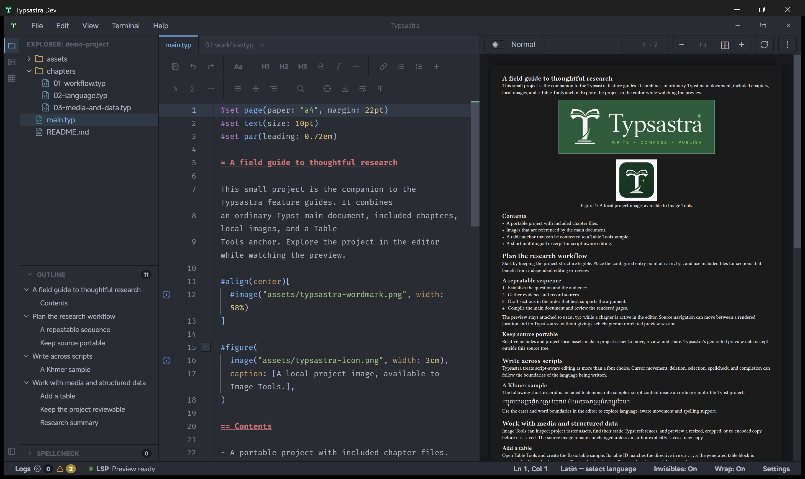

# PDF preview and source synchronization

Typsastra uses the same virtualized viewer for compiled Typst output and direct
PDF files. Only a bounded set of visible and nearby pages receives rendered
canvases, keeping long-document memory independent of total page count as far as
practical.

## Preview color modes

Open the preview overflow menu or **Settings → Preview** to choose:

- **Document colors** renders the PDF exactly as authored.
- **Dark preview** applies a hue-preserving dark transform while restoring
  PDF.js-reported embedded-image regions in their original colors.
- **Inverted preview (experimental)** applies a full-page inversion as a
  compatibility fallback.

The selection applies to compiled and standalone PDF previews and is remembered
across sessions. It changes only the viewer; exported PDFs keep their authored
colors.

## Scanner-generated PDFs

Some scanners produce mixed-raster-content (MRC) PDFs. A page may use a
low-resolution color or grayscale background plus a separate one-bit CCITT or
JBIG2 foreground mask for text and line art. If a viewer decodes only the
background, the page can look washed out or appear to be missing most of its
text.

Typsastra packages the PDF.js decoder resources required to render these layers
together in direct PDF view. This is a display compatibility feature: it does
not perform OCR, recompress the document, or change the source PDF.

## Page navigation

The toolbar shows current page and total page count. Enter a valid page number
to jump immediately. Forward sync also uses an immediate jump; it does not run a
long scroll animation through intermediate pages.

Zooming retains the current document viewport anchor where practical instead of
resetting to the top of the page. The configured main document and every source
file included by it also share one PDF page position, so switching between
chapters does not restore competing per-tab preview positions.

## Forward and inverse sync

Use **Reveal Cursor in Preview** or `Alt+Enter` (`Option+Enter` on macOS) for
forward sync. Tinymist currently supplies page and source-line positioning, not
a reliable exact horizontal word coordinate. Typsastra therefore lands at the
line position instead of guessing by PDF text matching.

Inverse sync depends on the source-map data-plane connection. Preview loading
warms the hidden source-map session without requesting a memory-heavy vector
snapshot. If synchronization fails, inspect the Typst synchronization log for
session readiness, WebSocket connection, request, and timeout events.

## Compilation failures

The last successful preview remains visible when a later compilation fails. Fix
the reported Typst diagnostic and save or edit according to the selected render
mode.

## Linux white preview

On affected Wayland/WebKitGTK systems, enable **Disable WebKitGTK DMA-BUF
renderer** under Settings → Preview → Linux preview compatibility and restart.
The option is Linux-only and may reduce rendering performance.

See [Preview implementation notes](../PREVIEW_INTERCEPTION.md) for internals.
