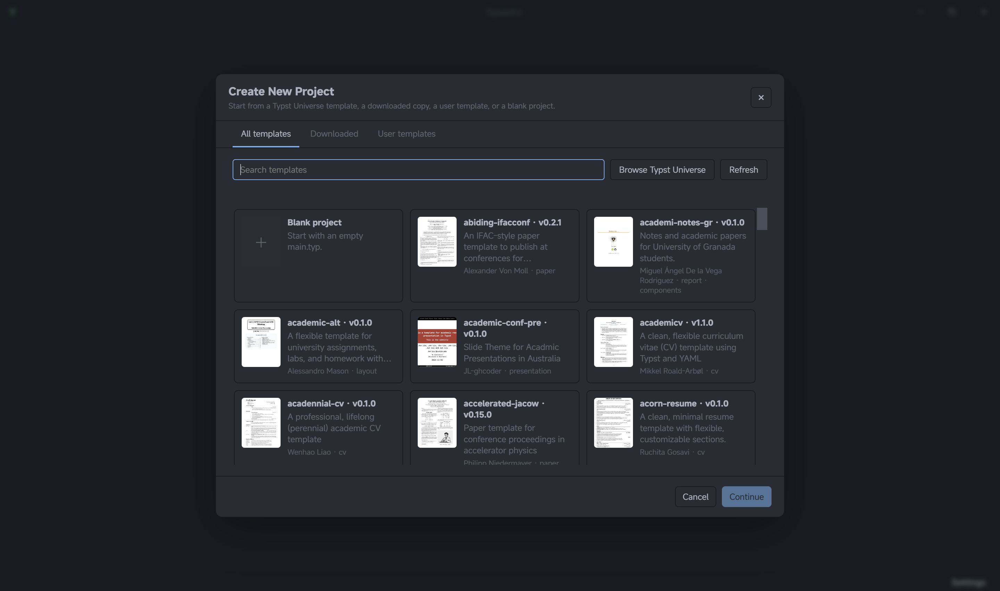

# Create a project from templates

The **Create New Project** browser creates ordinary Typst workspaces from a
blank starter, a Typst Universe template, a downloaded template, or a managed
user template.

## Browse and search

Open **File → New Project**. The browser has three catalogs:

- **All templates** searches the Typst Universe template catalog.
- **Downloaded** reuses Universe templates already cached on this machine.
- **User templates** lists `.typsastra` archives you have added for reuse.

Search terms match template names, descriptions, authors, categories, and
keywords; name matches rank first. The blank-project card is always available.
The Universe catalog refreshes online and keeps its last successful response for
offline browsing. Downloaded and user templates remain usable offline.

## Create the project

1. Select a template card to inspect its description and metadata.
2. Choose the destination parent folder.
3. Edit the proposed project name. Typsastra validates portable names and checks
   for an existing destination before creation.
4. Select **Create Project**. Universe templates are downloaded and cached when
   needed, then Typsastra creates and opens the workspace.

Creation uses a staging directory and promotes the finished project only after
its files and metadata are ready. An existing destination is never overwritten.
The resulting project contains normal Typst files plus `.typsastra` project
metadata; generated previews and caches remain machine-local.

## Reuse a user template

In **User templates**, choose **Add** and select a `.typsastra` project archive
to add it to the local template library. User templates are not silently
published to Typst Universe or copied to another machine.
