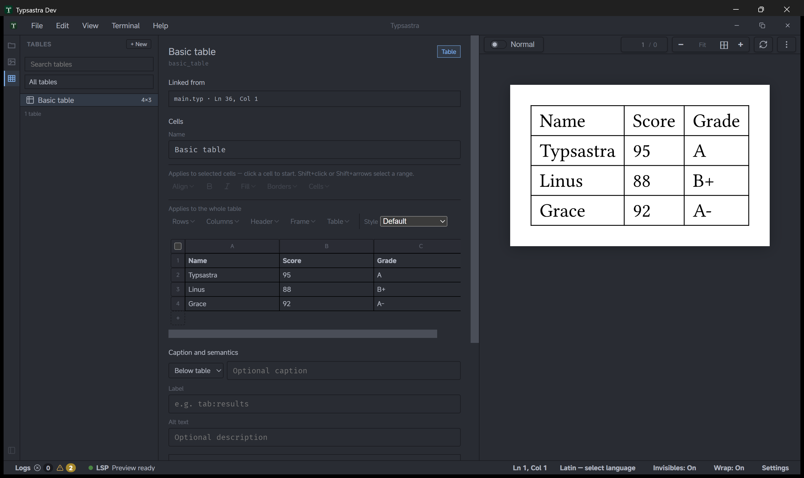
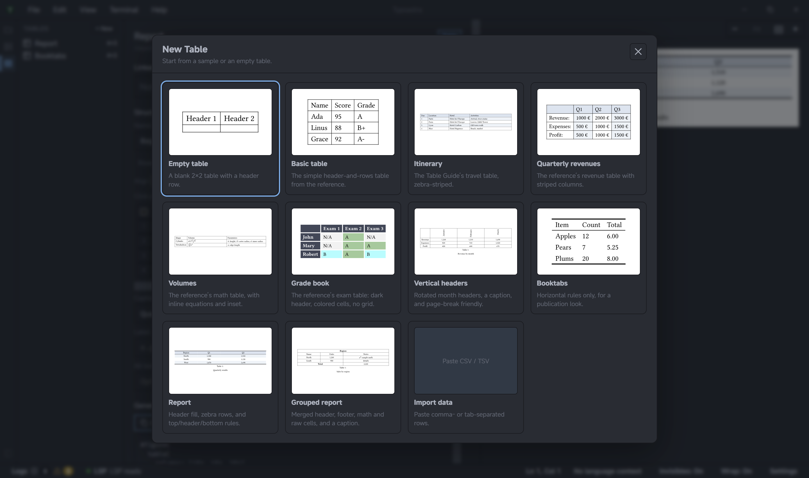

# Table Tools

Table Tools provides a spreadsheet-style editor for project-owned tables. Tables
are stored in the project's `.typsastra/config.json` and generated as ordinary
Typst source when linked to a document.

## Create or select a table

Open **Table Tools** in the sidebar. Choose **New** to create an empty table,
start from a built-in sample, or import comma- or tab-separated data. Select a
table from the sidebar list to edit it. Tables can be searched and filtered by
whether they are used by the current document, referenced elsewhere, or unused.

## Edit the grid

Click a cell to edit its text. Use row and column controls to insert, remove,
reorder, sort, or transpose data. Select a range to format cells, merge adjacent
cells, or adjust borders. Undo and redo are available for table edits.

The inspector also configures headers, repeating header/footer rows, table
style, stroke, banding, column and row tracks, gutter, cell alignment, emphasis,
fill, text color, insets, rotation, and page-breaking behavior. Add a caption,
label, and alternative description when the table is presented as a figure.

## Link a table to Typst source

Place a `//@table:<id>` directive in a Typst document to link a table. Table
Tools writes the generated table block at that anchor and keeps the block in
sync with grid edits. If the linked block is edited in the document, use the
table's linked-source action to read the changes back into the builder.

Tables can also be exported and imported losslessly as `.typ` source. Project
table definitions remain in portable project metadata; no separate table file
is created unless you explicitly export one.

## Try the demo

Open [`docs/demo-project`](../demo-project/README.md). It has a linked
**Basic table** stored in project metadata and a `//@table:basic_table` anchor in
`main.typ`. Change the first body cell. The generated Typst block and live
preview update with the table.
